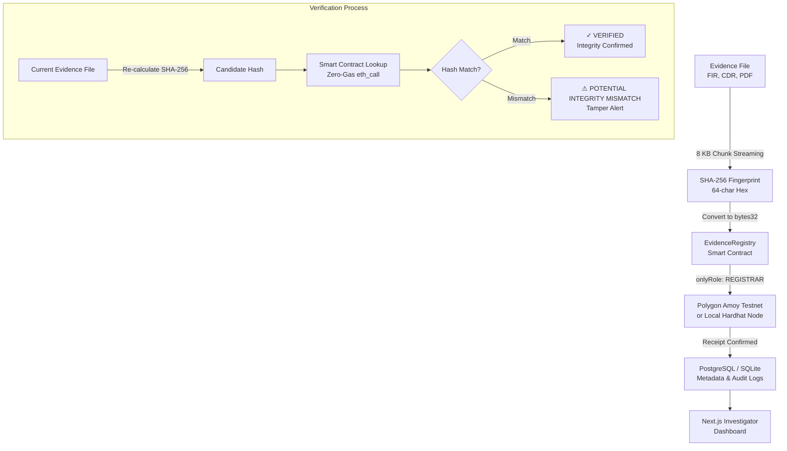

# Blockchain Evidence Integrity & Provenance Subsystem

[](https://soliditylang.org/)
[](https://hardhat.org/)
[](https://openzeppelin.com/)
[](https://fastapi.tiangolo.com/)
[](https://polygon.technology/)
[](LICENSE)

Production-style digital evidence integrity, tamper detection, and provenance anchoring subsystem for investigative intelligence platforms (FIRs, CDRs, Financial Records, Forensics).

---

## 1. Core Architecture & Principle

The blockchain component is **NOT responsible for investigation analysis or AI processing**. Its sole responsibility is:

> **Evidence integrity, tamper detection, provenance anchoring, and verifiable registration of evidence cryptographic hashes.**

Sensitive evidence files remain off-chain in secure storage. Only fixed 32-byte cryptographic fingerprints (`SHA-256` as `bytes32`) and pseudonymized IDs are anchored on the blockchain.



---

## 2. Directory Structure

```text
blockchain-evidence-integrity/
├── contracts/
│   └── EvidenceRegistry.sol          # Smart Contract (AccessControl, versioning, bytes32 hashes)
├── test/
│   └── EvidenceRegistry.test.ts      # 13 Hardhat unit tests (100% pass)
├── scripts/
│   ├── deploy.ts                     # Deployment & ABI export pipeline
│   ├── generate_synthetic_evidence.py # Synthetic FIR and CDR generator
│   └── demo_flow.py                  # 8-step end-to-end hackathon demonstration
├── backend/
│   ├── api/
│   │   └── routes_evidence.py        # REST API endpoints (register, verify, provenance)
│   ├── services/
│   │   ├── hashing.py                # 8 KB chunk streaming SHA-256 & bytes32 converters
│   │   ├── blockchain.py             # Web3.py client with transaction signing & retries
│   │   └── verification.py           # Verification engine & tamper mismatch detector
│   ├── models/
│   │   └── evidence.py               # SQLAlchemy ORM models
│   ├── schemas/
│   │   └── evidence.py               # Pydantic schemas
│   ├── tests/                        # Pytest unit & integration test suite (100% pass)
│   ├── database.py                   # DB connection & session factory
│   └── main.py                       # FastAPI application entrypoint
├── frontend/
│   ├── src/
│   │   ├── components/               # RegisterModal, VerifyModal, ProvenanceTimeline
│   │   └── pages/index.tsx           # Investigator Evidence Dashboard
│   ├── package.json
│   └── tailwind.config.js
├── docker/
│   ├── Dockerfile.backend
│   ├── Dockerfile.frontend
│   └── Dockerfile.hardhat
├── docker-compose.yml
├── .env.example
├── SECURITY.md                       # Threat model & zero-PII security specification
└── README.md
```

---

## 3. Quickstart Guide

### Prerequisites
* Node.js v18+ & npm
* Python 3.10+
* Docker & Docker Compose (optional)

### A. Smart Contract Setup & Tests

```bash
# Install dependencies
npm install

# Compile contracts
npm run compile

# Run smart contract unit tests (13 tests)
npm test

# Deploy locally and export ABI artifacts
npx hardhat run scripts/deploy.ts
```

### B. Python Backend Setup & Tests

```bash
# Install Python requirements
pip install -r backend/requirements.txt

# Run backend test suite (7 tests)
python -m pytest backend/tests -v

# Start FastAPI server
python -m uvicorn backend.main:app --host 0.0.0.0 --port 8000 --reload
```
API Documentation will be accessible at: `http://localhost:8000/docs`

### C. Next.js Investigator Dashboard

```bash
cd frontend
npm install
npm run dev
```
Dashboard will be accessible at: `http://localhost:3000`

### D. Run with Docker Compose

```bash
docker-compose up --build
```

---

## 4. End-to-End Synthetic Evidence Demonstration

Run the automated 8-step CLI demo:

```bash
# 1. Generate synthetic investigative files (FIR & CDR)
python scripts/generate_synthetic_evidence.py

# 2. Run the end-to-end interactive integrity & tamper demonstration
python scripts/demo_flow.py
```

### Demonstration Steps Covered:
1. **Evidence Ingestion**: Ingests `CASE-101-FIR.pdf`.
2. **SHA-256 Fingerprinting**: Generates `d607fb96...` via streaming buffer.
3. **Smart Contract Anchoring**: Submits transaction to `EvidenceRegistry.sol`.
4. **Transaction Receipt**: Obtains block number, transaction hash, and timestamp.
5. **Initial Verification**: Audits original file $\rightarrow$ `✓ VERIFIED`.
6. **Simulate Illicit Tampering**: Modifies 1 byte in the file storage.
7. **Re-run Verification**: Audits modified file $\rightarrow$ `⚠ POTENTIAL INTEGRITY MISMATCH`.
8. **Provenance History**: Displays full chronological audit trail.

---

## 5. API Reference

| Method | Endpoint | Description |
| :--- | :--- | :--- |
| `POST` | `/api/evidence/register` | Uploads evidence file, computes SHA-256, and anchors on blockchain. |
| `GET` | `/api/evidence` | Lists all registered evidence items. |
| `GET` | `/api/evidence/{id}` | Retrieves metadata and blockchain anchor for an evidence ID. |
| `GET` | `/api/evidence/{id}/verify` | Verifies stored file integrity against on-chain hash. |
| `POST` | `/api/evidence/{id}/verify-file` | Verifies an external candidate file against on-chain hash. |
| `GET` | `/api/evidence/{id}/provenance` | Returns full chronological audit timeline and verification logs. |
| `POST` | `/api/evidence/simulate-tamper/{id}` | Modifies 1 byte in storage to demonstrate tamper detection. |
| `POST` | `/api/evidence/restore-file/{id}` | Restores original file after tamper simulation. |

---

## 6. Security & Threat Mitigation

For detailed security architecture and threat modeling, see [SECURITY.md](file:///d:/sih/blockchain-evidence-integrity/SECURITY.md).
* **Zero PII on Public Chains**: No suspect names, phone numbers, or FIR contents are ever sent to the blockchain.
* **Role-Based Access Control**: Only authorized wallets (`EVIDENCE_REGISTRAR_ROLE`) can anchor evidence.
* **Append-Only Immutability**: Existing versions cannot be overwritten.
* **Zero-Gas Verification**: Verification uses `view` methods (`eth_call`), allowing free public auditing by judges, lawyers, and forensic analysts.
